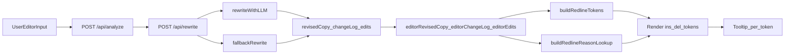

# Redline Hover Explanations: Technical Overview

## Purpose
This document describes the current implementation of redline hover explanations in the copy editor, including the intended goals, the existing architecture, and the known technical limitations.

## Product Goal
When a user views rewritten copy in **Redline** mode, hovering each redline segment (`add`/`del`) should explain **why that specific change was made**.

## Current Status (High-Level)
- Structured rewrite metadata (`edits[]`) is returned by the rewrite API.
- The UI renders diff tokens (`same`/`add`/`del`) and attaches tooltips to redline tokens.
- Tooltip reasons are mapped from `edits[]` using heuristic token matching.
- Feature works, but reason attribution can be inaccurate for some tokens (for example, a token can inherit a reason intended for a different nearby change).

## Core Files
- `app/page.tsx`
  - Copy editor UI, diff token rendering, tooltip UI, and token-to-reason mapping logic.
- `app/api/rewrite/route.ts`
  - Rewrite endpoint orchestration, fallback rewrite path, and response validation.
- `lib/analyzers/llm.ts`
  - LLM rewrite prompt/parse logic and `edits[]` generation contract.
- `lib/schema.ts`
  - Zod schema for rewrite response (`revisedCopy`, `changeLog`, `edits[]`).

## Data Contract (Current)
Rewrite response includes:
- `revisedCopy: string`
- `changeLog: string[]`
- `edits: RewriteEdit[]`

Where each `RewriteEdit` currently contains:
- `id: string`
- `type: "add" | "del" | "replace"`
- `beforeText: string`
- `afterText: string`
- `reason: string`
- `linkedIssueTitle?: string`

## End-to-End Flow

## Frontend Implementation Details

### 1) Redline generation
In `app/page.tsx`, the UI computes a token-level diff:
- Tokenizer splits into whitespace/non-whitespace tokens.
- LCS-style diff creates `DiffToken[]` with `type: "same" | "add" | "del"`.

### 2) Tooltip reason mapping
`buildRedlineReasonLookup(tokens, edits)` builds a `Map<tokenIndex, reason>`:
- Creates candidate pools from `edits[]`:
  - add candidates: `edit.type in ["add", "replace"]` using `afterText`
  - del candidates: `edit.type in ["del", "replace"]` using `beforeText`
- For each redline token, tries:
  1. exact normalized text match
  2. substring match (`candidate.includes(token)`)
  3. nearest candidate with remaining tokens
- Decrements candidate token budget as tokens are assigned.
- If no match is found, UI uses fallback reason:
  - `"Change made for tone consistency."`

### 3) Tooltip UI
Each `ins`/`del` token is wrapped in a tooltip component:
- Hover and keyboard-focus support (`aria-describedby`, focus ring, `role="tooltip"`).
- Whitespace-only redline tokens render without tooltip wrapper.

## Backend Implementation Details

### LLM rewrite path
`lib/analyzers/llm.ts` asks the model to return strict JSON including:
- `revisedCopy`
- `changeLog[]`
- `edits[]` with concrete before/after and reason

Response handling:
- Parses JSON
- Validates/sanitizes `edits[]`
- Returns structured output when valid

### Fallback rewrite path
`app/api/rewrite/route.ts` includes deterministic fallback behavior when LLM rewrite fails:
- Removes banned/high-risk phrases
- Adds FAQ/definition placeholders if needed
- Adds clipping edit if output exceeds allowed length range
- Emits `changeLog` and compatible `edits[]`

## Known Limitations
- **Heuristic mapping**: token-to-reason association is approximate, not guaranteed 1:1.
- **Reason drift**: nearby tokens can receive a reason from a broader edit (for example, "added heading").
- **No explicit spans**: current contract does not include stable character offsets linking edits directly to rendered diff tokens.
- **Fallback quality**: when LLM is unavailable, fallback edits can be coarse and less semantically precise.

## Goals (Refinement Targets)
1. Improve precision so each redline token gets the correct local reason.
2. Preserve accessibility and redline rendering performance.
3. Keep graceful degradation when structured edit metadata is partial/missing.
4. Maintain contract stability across LLM and fallback paths.

## Recommended Next Step
Move from heuristic token matching to **span-based mapping**:
- Extend `edits[]` with stable offsets/ranges in original and revised text.
- Build reason lookup by overlap with exact token spans rather than text containment.
- Keep current heuristic only as a backup path.

