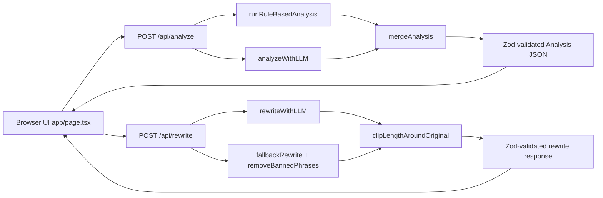

# Genius Voice + Visibility QA — Technical Architecture

## 1) System Overview

`Genius Voice + Visibility QA` is a single-page Next.js 14 App Router application that evaluates marketing copy across three engines:

- **Voice** (brand tone + compliance)
- **SEO** (search discoverability basics)
- **AEO** (answer engine readiness)

The application is intentionally hybrid:

1. **Deterministic rule engine always runs** (baseline reliability, transparent checks).
2. **LLM analysis runs opportunistically** when `OPENAI_API_KEY` is available.
3. **Strict schema validation via Zod** gates all analysis objects and rewrite payloads.
4. **Fallback-first behavior** ensures the user still gets structured output even when LLM is unavailable.

Core goals met by architecture:

- Works locally with one command (`npm run dev`)
- No API key exposure to browser
- Stable contract for UI rendering
- Brand-led design consistency via centralized CSS system

---

## 2) Runtime Architecture

### Request/response flow

### Deployment/runtime model

- **Framework**: Next.js 14 App Router (`app/` directory)
- **Execution split**:
  - Client-side interactivity in `app/page.tsx`
  - Server-side route handlers in `app/api/*/route.ts`
  - Server-only OpenAI integration in `lib/analyzers/llm.ts` via `import "server-only"`
- **State**: In-memory React state only (no DB/session persistence)

---

## 3) Source Tree and Responsibilities

- `app/layout.tsx`
  - Global shell and stylesheet imports.
  - Imports both `styles/globals.css` and `styles/genius-brand.css`.

- `app/page.tsx`
  - Single-page UI (inputs, action buttons, results rendering).
  - Calls `/api/analyze` and `/api/rewrite`.
  - Handles loading, error, reset, export JSON, and issue jump-to-offset behavior.

- `app/api/analyze/route.ts`
  - Validates request with Zod.
  - Always executes rule-based analysis.
  - Optionally calls LLM analysis.
  - Merges deterministic + LLM outputs, then schema-validates.

- `app/api/rewrite/route.ts`
  - Validates rewrite request with Zod.
  - Attempts LLM rewrite.
  - Falls back to deterministic rewrite if needed.
  - Applies length policy guard and response validation.

- `lib/schema.ts`
  - Canonical request/response schemas and types.
  - Defines strict score ranges and allowed enums.

- `lib/analyzers/rules.ts`
  - Deterministic analysis checks and score approximation model.
  - Banned phrase offsets and issue generation.
  - Helpers for rewrite fallback (`removeBannedPhrases`).

- `lib/analyzers/llm.ts`
  - OpenAI integration for analysis and rewrite.
  - Injects brand voice DNA + rubric.
  - Enforces JSON response + validates with Zod.

- `styles/genius-brand.css`
  - Primary design system for typography, tokens, forms, cards, buttons, motion.

- `styles/globals.css`
  - Minimal Tailwind layer entry points.

- `public/brand/*`
  - Brand assets (`genius-logo-full.png`, `genius-logo-g.png`).

- `public/fonts/*`
  - Uploaded font binaries; currently mapped through `@font-face`.

---

## 4) Data Contracts (Zod-Centric)

All critical payloads are validated in `lib/schema.ts`.

### Analyze request

- `meta`: `{ vertical, regionStyle, contentType, riskTier }` with constrained enums.
- free text fields: `primaryKeyword`, `secondaryKeywords`, `audience`, `cta`.
- required `copy`.

### Analysis response

Strongly typed object:

- `scores.voice`, `scores.seo`, `scores.aeo` each with weighted sub-dimensions.
- `scores.overall`.
- `issues[]` with:
  - `engine` in `voice|seo|aeo`
  - `severity` in `blocker|high|medium|low`
  - optional text offsets for source anchoring
- `quickFixes[]`
- `notes.assumptionsToConfirm[]`, `notes.riskyClaims[]`

### Rewrite request/response

- Request: `{ originalCopy, analysis }`
- Response: `{ revisedCopy, changeLog[] }`

Why this matters:

- Prevents malformed LLM JSON from reaching UI.
- Guarantees UI render assumptions remain valid.
- Creates a stable base for future API consumers.

---

## 5) Analysis Engine Internals

## 5.1 Deterministic Rules (`runRuleBasedAnalysis`)

This engine is always executed and produces complete output on its own.

### Rule set implemented

1. **Banned phrase detection**
   - General banned list always active.
   - Bet-specific prohibited list conditionally active when `vertical === "Bet"`.
   - Regex with word boundaries + global matches.
   - Captures `offsets` (`start`, `end`) for each match.
   - Severity escalates to `blocker` for certain bet terms.

2. **Adjective density heuristic**
   - Splits content by paragraph (`\n{2,}`).
   - Counts occurrences from curated strong-adjective list.
   - Flags paragraphs with more than 3 hits.

3. **Minimum Viable Specificity (MVS)**
   - Checks for all required dimensions:
     - product noun heuristic (capitalized token or product hints)
     - mechanism cue (`by`, `through`, `using`, `so that`, `via`)
     - proof cue (numbers/% or proof lexicon)
     - CTA verb coverage (from CTA field + copy text)
   - Missing any dimension creates a high-severity voice issue.

4. **SEO checks**
   - Primary keyword presence in first 120 words.
   - Heading detection for content types requiring structure (`Blog`, `SEO Pillar`, `Landing Page`).

5. **AEO checks**
   - Definition sentence check for primary keyword in first 200 words (`<keyword> is ...` pattern).
   - FAQ readiness check: requires FAQ token or at least 2 question marks.

6. **Notes extraction**
   - Risky claim phrase detection.
   - Assumption flags for missing explicit commercial outcomes / localization clarity.

### Scoring model

- Starts from base scores (`voice 92`, `seo 88`, `aeo 86`).
- Applies penalties by issue count + severity-weight aggregate.
- Clamps engine totals to `0..100`.
- Computes sub-scores by weighted proportions and capped rubric maxima.
- `overall` is arithmetic mean of voice/seo/aeo totals.

This is intentionally heuristic, explainable, and robust without LLM availability.

## 5.2 LLM Analysis (`analyzeWithLLM`)

When `OPENAI_API_KEY` exists:

- Builds a prompt containing:
  - explicit JSON contract
  - Brand Voice DNA
  - Voice/SEO/AEO rubric weights
  - full request payload context
- Uses `response_format: { type: "json_object" }`.
- Parses and validates output with `analysisSchema`.
- Returns `null` on any failure path (missing key, API error, parse error, schema mismatch).

### Hybrid merge strategy

`app/api/analyze/route.ts` merges rule + LLM outputs:

- `meta`: deterministic source
- `scores`: LLM-preferred when valid
- `issues`: union with dedupe (`engine+severity+title`)
- `quickFixes`: set union
- `notes`: set union
- Final object revalidated with `analysisSchema`; fallback to pure rule result if invalid.

This protects deterministic compliance signals while still benefiting from richer LLM scoring and feedback.

---

## 6) Rewrite Engine Internals

## 6.1 LLM Rewrite (`rewriteWithLLM`)

- Prompt constraints enforce:
  - preserve meaning
  - no invented facts/metrics/partners/certifications
  - remove risky/gimmicky language
  - include AEO placeholders if needed
  - length policy by content type
- Expects strict JSON:
  - `revisedCopy`
  - `changeLog[]`
- Returns `null` on parse/shape/API failures.

## 6.2 Deterministic fallback (`fallbackRewrite`)

If LLM rewrite fails/unavailable:

- Removes banned phrases with regex substitution.
- Ensures FAQ block exists (adds placeholders when absent).
- Ensures early definition statement exists (placeholder injection when absent).
- Produces deterministic `changeLog`.

## 6.3 Length guard (`clipLengthAroundOriginal`)

- For non-social content, target revised copy within `±15%` of original word count.
- If too long, truncates and appends length-trim note to `changeLog`.
- (If too short, current implementation does not auto-expand.)

---

## 7) UI Architecture and Interaction Design

`app/page.tsx` is a client component with local state machine behavior.

### Input panel

- Captures all analysis context fields:
  - vertical, region, content type, risk tier
  - keyword fields
  - audience + CTA
  - primary copy textarea
- Action buttons:
  - Analyze
  - Rewrite to fix issues
  - Reset

### Result panel

- Score tiles (Voice/SEO/AEO), overall score.
- Sub-score display for each engine.
- Engine-grouped issue lists with severity badges.
- Offset-based jump behavior:
  - selecting issue with offsets highlights selection range in original copy textarea.
- Quick fixes, risky claims, assumptions sections.
- Revised draft + changelog shown only after rewrite.
- JSON export to local file via `Blob` + object URL.

### Error resilience

- API failures are surfaced in a non-crashing banner.
- Loading states (`isAnalyzing`, `isRewriting`) gate button labels/availability.

---

## 8) Brand Consistency Enforcement Model

Brand consistency is implemented as **system-level styling constraints + voice-level content rules**.

## 8.1 Visual consistency (design system)

Primary mechanism: `styles/genius-brand.css` imported globally in `app/layout.tsx`.

Enforcement characteristics:

- Centralized design tokens (`--color-*`, spacing scale, radii, font families).
- Global typographic defaults (`h1..h6`, body text, list rhythm).
- Shared component primitives:
  - `.container`, `.section`, `.section-navy`
  - `.card`
  - `.button`, `.button-primary`, `.button-secondary`, `.button-outline`
  - form controls (`input`, `textarea`, `select`, `label`, `.form-group`)
  - utility styles (`.stat-compact`, `.fade-in`, etc.)
- Tailwind is intentionally minimal and mostly structural (grid, spacing, responsive).

Effectively, the app’s visual identity is constrained to brand classes and variables rather than ad hoc component-level styling.

## 8.2 Voice consistency (content QA)

Brand voice rules are enforced by both engines:

- Deterministic rules catch hard violations (banned phrase classes, MVS gaps, risky claim language).
- LLM prompt injects explicit non-negotiable voice DNA and scoring rubric.
- Hybrid merge keeps deterministic findings even when LLM provides additional issues/scores.

This creates defense in depth:

- deterministic precision for known constraints
- model-driven judgment for nuanced editorial quality

---

## 9) Security and Data Boundary Controls

- `OPENAI_API_KEY` is accessed server-side only (`process.env` in `lib/analyzers/llm.ts`).
- `server-only` import prevents accidental client bundling of OpenAI code.
- Client never directly calls OpenAI.
- No persistent storage layer currently; data lives in request/response + client state.

---

## 10) Performance Characteristics

- Lightweight runtime: no DB, no external queues, no extra services.
- Request latency primarily driven by:
  - fast local rules (regex/string operations)
  - optional OpenAI round trip when enabled
- Build is static for `/` page plus dynamic API routes.

Current implementation is appropriate for POC load and easy to harden for production.

---

## 11) Known Gaps and Future Hardening

1. **Scoring calibration**
   - Rule-based penalties are heuristic; can be benchmarked against labeled examples.

2. **Rewrite length behavior**
   - Over-length responses are trimmed; under-length not expanded.
   - Could be made symmetric.

3. **Observability**
   - No structured logging/metrics/tracing currently.

4. **Testing**
   - No automated test suite yet (unit/integration/e2e recommended).

5. **API hardening**
   - No auth/rate limiting/throttling yet.
   - Add for public or multi-tenant deployment.

6. **Persistence**
   - No saved analyses/history/versioning.
   - Easy extension via Supabase/Postgres.

7. **Prompt governance**
   - Could externalize voice DNA/rubric configs to admin-editable policy files.

---

## 12) Extension Blueprint

High-confidence extension points:

- Add `lib/analyzers/rules/*.ts` modular rule packs by engine.
- Add entity extraction and named-claim verification as new AEO/voice subs.
- Add optional retrieval layer for internal links and factual grounding.
- Add storage:
  - analyses table
  - rewrite versions
  - issue audit trail
- Add review workflow:
  - draft status
  - approver comments
  - compliance sign-off

---

## 13) Practical “How It Actually Works” Summary

At a practical level:

1. User enters copy and metadata in `/`.
2. Frontend posts JSON to `/api/analyze`.
3. Server validates input, runs rules, optionally runs LLM, merges safely, returns typed analysis.
4. UI renders scores/issues and allows offset jumping + JSON export.
5. User requests rewrite; frontend posts original copy + prior analysis to `/api/rewrite`.
6. Server attempts LLM rewrite under constraints; if unavailable, applies deterministic fallback rewrite.
7. UI displays revised draft + changelog.

The application therefore functions as an actual QA engine with deterministic guarantees, optional model augmentation, and a brand-governed UX surface.

